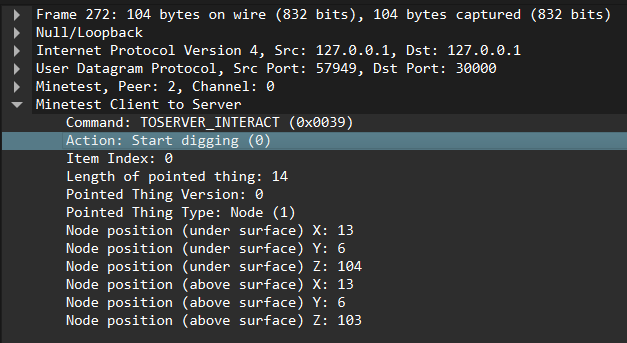

# pcap-busters-2 

## prompt - This time you ran across their activities in an illegal game server using a suspicious protocol, analyze the pcap and get the flag!!

By analyzing the file we wont get any hints 

But from the prompt, it is ssaid that the UDP streamis a game protocol...
and keywords like fancy_bed_bottom,whitedirtacacia_bush_leaves

it appears like a minecraft protocol, but its minetest...

There is a .lua  Wireshark plugin available on internet for decoding the protocol...

This plugin will help decode the protocol



There are 6 type of actions relayed:
```

        [0] = "Start digging",
		[1] = "Stop digging",
		[2] = "Digging completed",
		[3] = "Place block or item",
		[4] = "Use item",
		[5] = "Activate held item",
```


